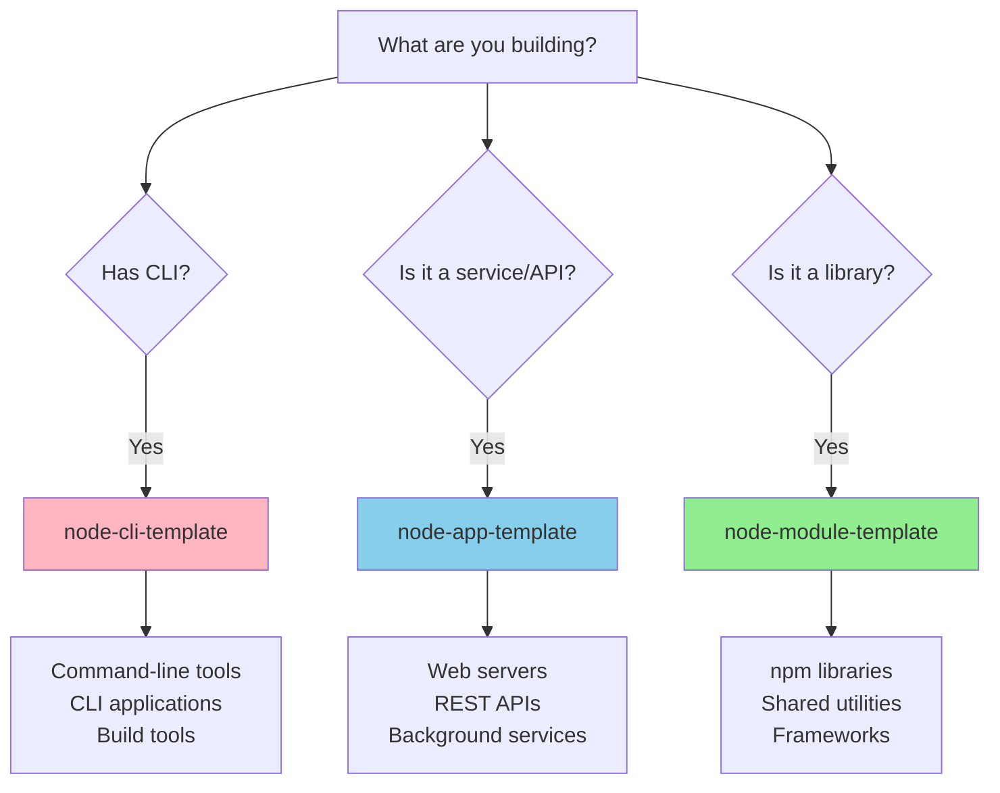
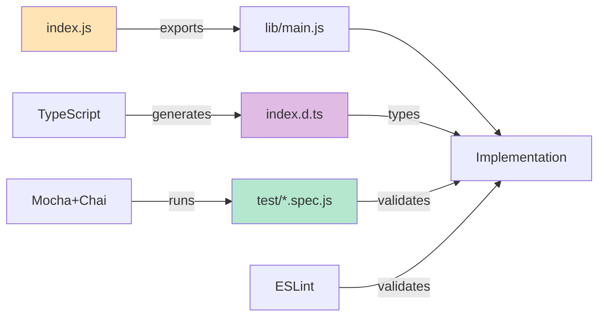
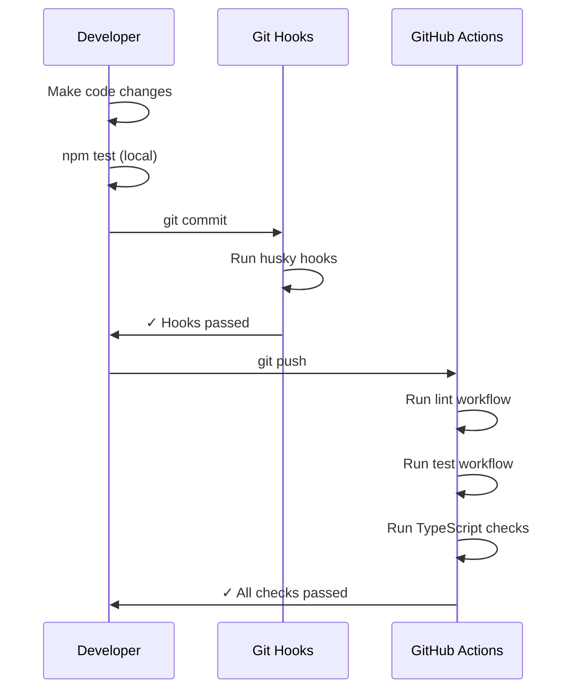

# GitHub Copilot Instructions for Node Module Template

## Overview

This repository is a **template for creating Node.js library modules** - packages that provide reusable functionality to other projects. It implements best practices for modern Node.js module development with TypeScript types in JavaScript, ESM modules, and comprehensive testing.

### When to Use This Template

Use this template when creating:
- **Libraries and utilities** that will be published to npm
- **Shared code modules** used across multiple projects
- **Packages with no CLI or server components**

### Related Templates

Consider these alternatives depending on your project type:



**Use [node-cli-template](https://github.com/voxpelli/node-cli-template) when:**
- Building command-line tools or CLI applications
- Creating build tools or generators
- Need to execute commands from the terminal

**Use [node-app-template](https://github.com/voxpelli/node-app-template) when:**
- Building web servers, REST APIs, or GraphQL services
- Creating background workers or daemons
- Need long-running processes or services

### Project Architecture



### Development Workflow



---

## Coding Guidelines for GitHub Copilot

### Code Style and Standards

1. **JavaScript Style**
   - Use ESM (ECMAScript Modules) syntax exclusively (`import`/`export`)
   - Follow [neostandard](https://github.com/neostandard/neostandard) JavaScript style guide
   - Use single quotes for strings
   - Include semicolons
   - 2-space indentation

2. **Type Safety**
   - Use TypeScript for type definitions but write JavaScript for implementation
   - Include JSDoc comments with type annotations
   - Maintain strict type coverage (>99%)
   - Generate `.d.ts` files from JSDoc annotations
   - Example:
     ```javascript
     /**
      * @param {string} input - The input value
      * @param {SomethingOptions} [options] - Optional configuration
      * @returns {Promise<boolean>}
      */
     export async function something(input, options) {
       // implementation
     }
     ```

3. **Module Structure**
   - Main entry point: `index.js` (exports from lib)
   - Implementation: `lib/*.js` files
   - Type definitions: `lib/*-types.d.ts` for complex types
   - Keep index.js minimal - just re-exports

4. **File Organization**
   ```
   /index.js              # Main entry, re-exports from lib
   /index.d.ts            # Generated type definitions
   /lib/main.js           # Core implementation
   /lib/advanced-types.d.ts  # Complex type definitions
   /test/*.spec.js        # Mocha test files
   ```

### Testing

1. **Test Framework**
   - Use Mocha for test runner
   - Use Chai for assertions
   - Place tests in `test/` directory with `.spec.js` extension
   - Example:
     ```javascript
     import { describe, it } from 'mocha';
     import chai from 'chai';
     
     const { expect } = chai;
     
     describe('something()', () => {
       it('should return true', async () => {
         const result = await something('test');
         expect(result).to.equal(true);
       });
     });
     ```

2. **Code Coverage**
   - Use c8 for coverage reporting
   - Aim for high coverage on new code
   - Coverage reports generated in LCOV and text formats

3. **Running Tests**
   - `npm test` - Full test suite with checks
   - `npm run test:mocha` - Just the tests
   - `npm run check` - Linting and type checking only

### Building and Type Generation

1. **Build Process**
   - `npm run build` - Clean and generate type declarations
   - TypeScript compiler generates `.d.ts` files from JSDoc
   - Clean old declarations before building

2. **Type Configuration**
   - `tsconfig.json` - Main TypeScript config for type checking
   - `declaration.tsconfig.json` - Config for generating declarations
   - Commit hand-written type files (`lib/*-types.d.ts`, `index.d.ts`)
   - Don't commit auto-generated `.d.ts` files (generated from JSDoc)

### Dependencies

1. **Adding Dependencies**
   - Avoid adding dependencies unless absolutely necessary
   - Prefer modern Node.js built-in APIs
   - Production dependencies should be minimal
   - Use exact versions in package.json when possible

2. **Development Dependencies**
   - Keep devDependencies up to date via Renovate
   - Use `installed-check` to verify dependency hygiene
   - Use `knip` to detect unused dependencies

### Code Quality Tools

1. **ESLint**
   - Configuration: `eslint.config.js`
   - Based on `@voxpelli/eslint-config`
   - Run: `npm run check:lint`
   - Fix automatically when possible

2. **TypeScript Checking**
   - Run: `npm run check:tsc`
   - Ensures type correctness without compilation
   - Check type coverage: `npm run check:type-coverage`

3. **Knip**
   - Detects unused files, dependencies, and exports
   - Configuration: `.knip.jsonc`
   - Run: `npm run check:knip`

### Git and Version Control

1. **Commits**
   - Use conventional commit messages when appropriate
   - Husky pre-commit hooks will run checks
   - Keep commits focused and atomic

2. **Branching**
   - Main branch: `main`
   - Feature branches: descriptive names
   - CI runs on all pull requests

### Node.js Version Support

- Required versions: `^20.15.0 || >=22.2.0`
- Target latest LTS versions
- Use modern JavaScript features available in these versions
- No transpilation needed

### Publishing (for reference)

- Package is published to npm
- `files` field in package.json controls what's published
- Include: `index.js`, `index.d.ts`, `lib/**/*.js`, `lib/**/*.d.ts`
- Exclude: tests, config files, source `.ts` files

### Special Notes

1. **This is a Template Repository**
   - This repo serves as a starting point for new modules
   - When using this template, update:
     - `package.json` (name, description, repository, keywords)
     - `README.md` (replace with actual project documentation)
     - Implementation in `lib/` directory
     - Tests in `test/` directory

2. **External Projects Using This Style**
   - Projects can reference these instructions to understand the coding style
   - This template demonstrates Node.js module best practices
   - See README for real-world usage examples

3. **Workflow Files**
   - `.github/workflows/lint.yml` - Linting checks
   - `.github/workflows/nodejs.yml` - Test suite on multiple Node versions
   - `.github/workflows/ts-internal.yml` - TypeScript internal checks
   - `.github/workflows/dependency-review.yml` - Dependency security

### Common Commands

```bash
# Install dependencies
npm install

# Run all checks and tests
npm test

# Run only linting
npm run check:lint

# Run only tests
npm run test:mocha

# Build type declarations
npm run build

# Clean generated files
npm run clean
```

### Anti-Patterns to Avoid

1. ❌ Don't use CommonJS (`require`/`module.exports`)
2. ❌ Don't add unnecessary dependencies
3. ❌ Don't skip type annotations in JSDoc
4. ❌ Don't commit auto-generated `.d.ts` files (only commit hand-written ones)
5. ❌ Don't use `any` types without good reason
6. ❌ Don't skip tests for new functionality
7. ❌ Don't mix module systems

### Best Practices

1. ✅ Write clear JSDoc comments with types
2. ✅ Export everything through index.js
3. ✅ Keep functions small and focused
4. ✅ Use async/await for asynchronous operations
5. ✅ Validate inputs and provide helpful error messages
6. ✅ Write tests that are clear and maintainable
7. ✅ Follow the existing code style consistently

---

## Quick Reference for External Projects

If your project wants to follow the voxpelli Node.js module style:

1. **Template Choice**: Start with the appropriate template
   - Libraries → `node-module-template`
   - CLIs → `node-cli-template`
   - Services → `node-app-template`

2. **Key Characteristics**:
   - ESM modules only
   - Types in JavaScript (JSDoc + TypeScript)
   - Neostandard code style
   - Mocha + Chai testing
   - Strict type coverage
   - Minimal dependencies

3. **Reference Documentation**:
   - This file: Coding guidelines and standards
   - README.md: Project-specific usage
   - package.json: Available scripts and commands

4. **Getting Started**:
   ```bash
   # Use this template
   npx degit voxpelli/node-module-template my-module
   cd my-module
   npm install
   npm test
   ```
