# @voxpelli/tstyche-reporters

Custom [TSTyche](https://tstyche.org/) reporters for TypeScript type testing, featuring Mocha-style hierarchical output and compact dot notation with environment-controlled Markdown/CLI dual-mode formatting.

## Quick Overview

This module provides two ready-to-use TSTyche reporters plus an extensible base class:

```mermaid
graph LR
    subgraph "This Module"
        Base[TstycheBaseReporter]
        Mocha[TstycheMochaReporter]
        Dot[TstycheDotReporter]
    end

    Base --> Mocha
    Base --> Dot
    Base -.->|extend| Custom[Your Custom Reporter]

    Mocha -->|outputs| MochaOut["## describe<br/>✔ test passed<br/>✖ test failed"]
    Dot -->|outputs| DotOut["...F..F...."]

    style Base fill:#E0BBE4
    style Mocha fill:#B4E7CE
    style Dot fill:#FFE4B5
    style Custom fill:#87CEEB,stroke-dasharray: 5 5
```



### Module Architecture


### Key Features

| Feature | Description |
|---------|-------------|
| 🎨 Dual-mode output | CLI (colors/symbols) or Markdown (emoji) controlled by environment variable |
| 🔧 Environment control | Set `TSTYCHE_REPORTERS_MARKDOWN=true` for Markdown output |
| 📊 Two styles | Mocha hierarchical or dot notation |
| 🔄 Multi-version | TypeScript version headers when testing multiple compilers |
| ⚡ Streaming | Real-time test output, not buffered |
| 🧩 Extensible | Base class for custom reporters |

---

## Development Commands

```bash
# Install dependencies
npm install

# Run all checks and tests
npm test

# Run only checks (lint, types, knip)
npm run check

# Run only linting
npm run check:lint

# Run only type checking
npm run check:tsc

# Build type declarations
npm run build

# Clean generated files
npm run clean

# Test with dot reporter
npm run test:tstyche-dot

# Test with mocha reporter
npm run test:tstyche-mocha
```

---

## Coding Guidelines for Copilot

### Code Standards

#### JavaScript Style
- **ESM only**: Use `import`/`export` exclusively (no CommonJS)
- **Style guide**: Follow [neostandard](https://github.com/neostandard/neostandard)
- **Strings**: Single quotes
- **Semicolons**: Always include
- **Indentation**: 2 spaces

#### Type Safety
- Write JavaScript with JSDoc type annotations
- TypeScript generates `.d.ts` files from JSDoc
- Maintain strict type coverage (>99%)
- Import types using `/** @import { Type } from 'module' */`

Example:
```javascript
/** @import { ResolvedConfig, ReporterEvent } from 'tstyche/tstyche' */

/**
 * Handle a test event.
 *
 * @param {ReporterEvent} event - The TSTyche event tuple
 * @returns {void}
 */
on(event) {
  // implementation
}
```

### File Organization

```
/index.js                    # Re-exports from lib/main.js
/index.d.ts                  # Hand-written, exports from lib/main.js
/lib/main.js                 # Module exports
/lib/tstyche-base-reporter.js    # Base class implementation
/lib/tstyche-dot-reporter.js     # Dot reporter implementation
/lib/tstyche-mocha-reporter.js   # Mocha reporter implementation
/lib/utils.js                # Utility functions
/test/*.spec.js              # Node.js test runner tests
/typetests/*.test.ts         # TSTyche type tests
```

### Testing Requirements

1. **Unit tests**: Use Node.js test runner with `node --test`
2. **Type tests**: Use TSTyche in `typetests/` directory
3. **Coverage**: c8 generates LCOV and text reports
4. **All tests must pass** before committing

### Extending Reporters

When creating or modifying reporters, extend `TstycheBaseReporter`:

```javascript
import { TstycheBaseReporter } from './tstyche-base-reporter.js';

export default class MyReporter extends TstycheBaseReporter {
  // Required: handle passing tests
  _onTestPass(payload) { }

  // Required: handle failing tests
  _onTestFail(payload) { }

  // Required: handle run completion
  _onRunEnd(payload) { }
}
```

#### Available Hooks

| Method | When Called | Required |
|--------|-------------|----------|
| `_onRunStart` | Test run begins | No |
| `_onProjectUses` | TypeScript version detected | No |
| `_onFileStart` | Test file starts | No |
| `_onDescribeStart` | Describe block opens | No |
| `_onDescribeEnd` | Describe block closes | No |
| `_onTestPass` | Test passes | **Yes** |
| `_onTestFail` | Test fails | **Yes** |
| `_onRunEnd` | Test run completes | **Yes** |
| `_onError` | Error event occurs | No |
| `_beforePrintCompilerVersion` | Before version header | No |

### Dependencies

- **Production**: Keep minimal (`markdown-or-chalk` only)
- **Peer**: `tstyche>=6.1.0` (optional)
- **Avoid** adding new dependencies unless absolutely necessary

### Anti-Patterns to Avoid

- ❌ CommonJS (`require`/`module.exports`)
- ❌ Unnecessary dependencies
- ❌ Missing JSDoc type annotations
- ❌ Committing auto-generated `.d.ts` files
- ❌ Using `any` types without justification
- ❌ Skipping tests for new functionality
- ❌ Buffering output instead of streaming

### Best Practices

- ✅ Clear JSDoc comments with types
- ✅ Export through index.js → lib/main.js
- ✅ Small, focused functions
- ✅ Stream output as tests execute
- ✅ Handle all TSTyche event types
- ✅ Support both CLI and Markdown modes
- ✅ Follow existing code patterns

---

## CI/CD

### GitHub Actions Workflows

- `lint.yml` - ESLint checks
- `nodejs.yml` - Test suite on multiple Node.js versions
- `ts-internal.yml` - TypeScript internal checks
- `dependency-review.yml` - Dependency security

### Required Checks

All of these must pass:
1. `npm run check:lint` - Code style
2. `npm run check:tsc` - Type checking
3. `npm run check:knip` - Unused code detection
4. `npm run check:installed-check` - Dependency hygiene
5. `npm run test:node` - Unit tests
6. `npm run test:tstyche` - Type tests

---

## Publishing

The package is published to npm as `@voxpelli/tstyche-reporters`.

### Published Files

```
index.js
index.d.ts
index.d.ts.map
lib/**/*.js
lib/**/*.d.ts
lib/**/*.d.ts.map
```

### Pre-publish

`npm run prepublishOnly` automatically runs `npm run build` to generate declarations.
